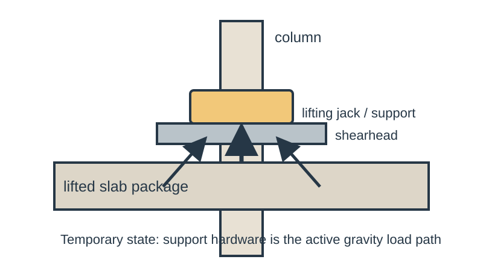
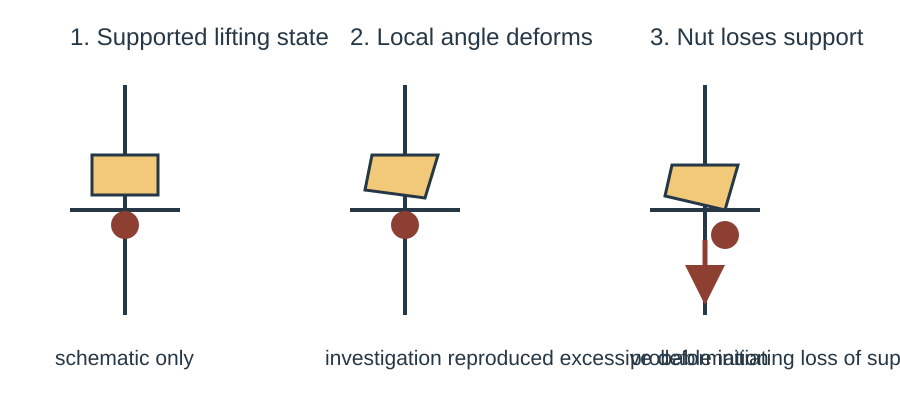
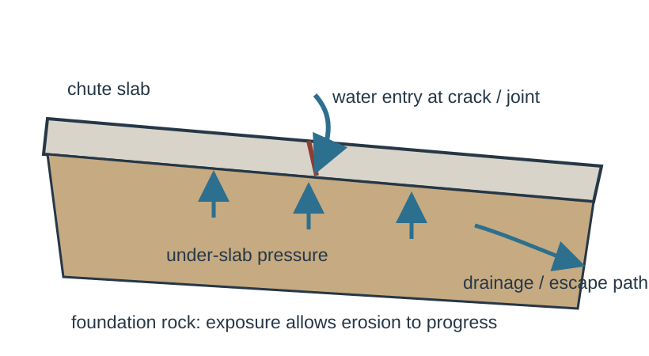
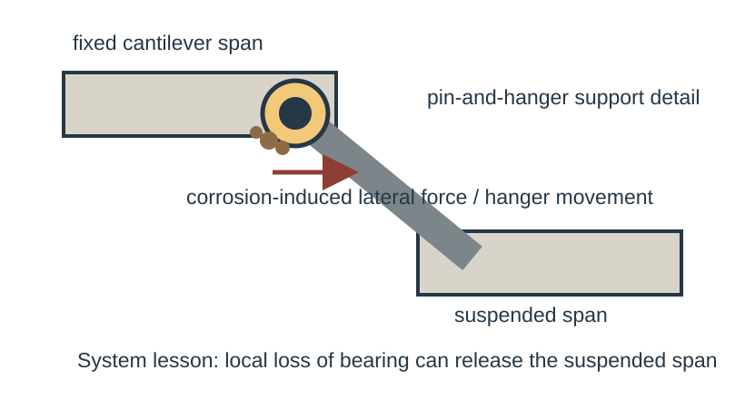
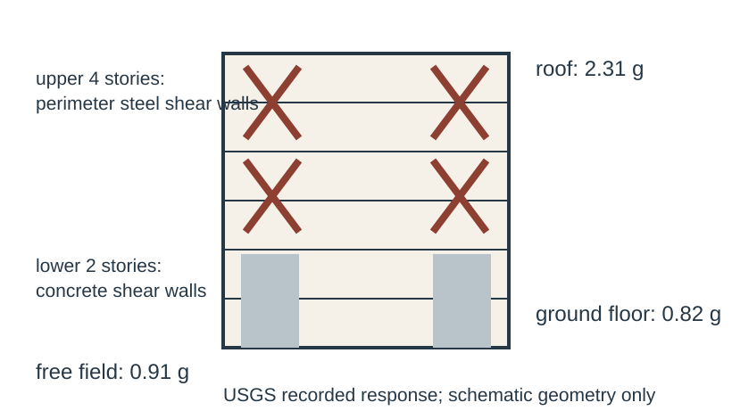
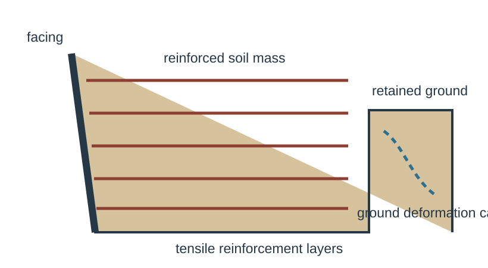

# Engineering Casebook 005 — Nothing Is Secondary

**Diagnostic draft • 18 August 2026 • ISSUE-005**

The five cases in this issue share an awkward lesson: systems fail when engineers mentally demote the thing that is actually carrying the consequence. A temporary jack, a drainage path, a pin-and-hanger, a lateral-force system, or a reinforced soil mass may look like supporting cast. Under the wrong load state, each becomes the structure.

---

## PAGE 1 — DEEP DIVE

# L’Ambiance Plaza
## The temporary lifting detail was the gravity system

**Bridgeport, Connecticut • 1987 • Lift-slab construction • CASE-018**

On 23 April 1987, the partially completed L’Ambiance Plaza apartment complex collapsed during lift-slab construction. The National Bureau of Standards investigation did not treat the event as a generic “construction collapse.” It reconstructed the load path at the instant of failure and tested the hardware that was then holding the slabs in the air. Its conclusion was brutally specific: the most probable initiating event was loss of support at one lifting jack in the west tower while an upper package of three floor slabs was being positioned. The investigation reproduced a mechanism in which a lifting angle in the shearhead assembly deformed excessively and the lifting nut slipped free. [@SRC-0024]

That detail matters because lift-slab construction reverses the usual mental hierarchy. In the completed building, the slabs are supported permanently by columns and their connections. During lifting, however, a slab package is suspended from a temporary system of jacks, rods, shearheads and bearing hardware. For that period the temporary arrangement is not “means and methods” sitting beside the structure. It **is the active gravity-resisting system**.

### Reconstruct the state, not the finished drawing

The first technical figure shows the essential temporary load path without inventing dimensions. The slab package delivers gravity load into the lifting points. Those forces pass through the jack/support hardware and shearhead into the columns. The failure investigation focused on a local support because the system’s safety depended on each active lifting point retaining a reliable force path while the slabs were moving.

The second figure translates the NBS mechanism into three states: supported lifting, excessive local deformation of the lifting angle, and loss of nut support. The importance is not the cartoon geometry. It is the sequence. A component can remain recognisable and yet cease to perform the geometric job that lets another component bear. Once the support condition changes, the force path changes immediately.

### YOU ARE THE ENGINEER

A contractor proposes lifting a multi-level slab package using a proprietary or specialist system. The permanent structure has been checked thoroughly. What do you ask for before the lift?

A weak answer is “the jack capacity.” Capacity of the hydraulic device is only one piece. You need the **temporary structural model**: where load enters each lifting point; how tolerances and deformation affect bearing; how the lifted package is stabilised laterally; what happens if one point moves differently; whether load can redistribute safely; what temporary bracing exists; and which observations trigger a stop. A component that is strong in isolation can still be unsafe if a few millimetres of deformation changes its bearing geometry. The NBS work is useful precisely because it examined hardware behaviour, not merely nominal member strength. [@SRC-0024]

### The construction stage is a separate structure

Construction-stage design is often treated as a sequence of reduced versions of the final building. That is sometimes dangerously wrong. The topology itself can be different. Supports may exist that vanish later. Permanent diaphragms may not yet be engaged. Dead load may be concentrated in lifted packages rather than distributed floor by floor. Temporary attachments may introduce eccentricity or local deformation modes never present in service.

So the correct question is not “is the final building strong enough?” It is “what structure exists **right now**?”

This is the same reason formwork, falsework, launching equipment and erection bracing deserve explicit engineering. Draw the actual load path for every critical stage. If a stage depends on a few temporary points, test the consequences of one point losing stiffness, bearing or alignment. If redistribution is relied upon, show where the redistributed force goes and whether the receiving components can accept it.

### Engineer’s Notebook — NOTE-005

**Temporary works are the structure until the permanent path exists.**

When a component is being lifted, propped or transferred, review that state as an independent structural system. Check local deformation compatibility, support loss, stability, load redistribution and stop-work criteria. “Temporary” describes duration, not consequence.

### Evidence boundary

The diagnostic figures deliberately omit dimensions, jack loads and reinforcement quantities not directly extracted from the NBS investigation. The mechanism is documented; invented precision would make the explanation look stronger while making it less true.

### Sources for this case

**Primary — Tier A:** National Bureau of Standards / National Institute of Standards and Technology, *Investigation of L’Ambiance Plaza Building Collapse in Bridgeport, Connecticut (NBS IR 87-3640)*, 1987.  
https://www.nist.gov/publications/investigation-lambiance-plaza-building-collapse-bridgeport-connecticut-nbs-ir-87-3640

---

## PAGE 2 — PROBLEMS FROM PRACTICE

# Site Problem — Oroville Dam Spillway
## Water beneath the slab was a structural load

**California • 2017 incident / 2018 forensic report • CASE-019**

The Oroville service spillway failure is enormous in scale, but its transferable lesson fits on an ordinary site sketch. The independent forensic investigation described water entering beneath the concrete chute slab through cracks and joints. Where relief was inadequate, that water could create uplift pressures beyond the slab system’s available resistance. Once local slab damage exposed the foundation, high-velocity flow attacked variable-quality rock and erosion progressed rapidly. [@SRC-0025]

The mechanism is easy to miss because engineers often draw water above concrete and loads below it. Here, water reached the underside. The slab then had hydraulic pressure trying to lift it while flow through defects and damaged areas created a pathway for progressive foundation loss.

For an ordinary building slab, apron, channel, retaining-wall footing or paved drainage structure, the scale changes but the questions survive:

1. Where can water enter beneath the concrete?
2. Can it drain faster than it can enter?
3. What pressure develops if the drain is blocked or overwhelmed?
4. What happens after the first local crack, lift or washout?
5. Can inspection reveal the drainage system has stopped working?

This is why a weep hole, drainage blanket, subdrain or sealed joint is not merely a durability accessory. It can determine the load case.

### YOU ARE THE ENGINEER

A sloping concrete apron has recurring cracks and a history of wet ground. The surface looks serviceable. Do you simply seal the cracks?

Not until the pressure path is understood. Sealing the top may reduce entry, but it can also hide symptoms while water continues to arrive from groundwater or upslope sources. Establish where the water comes from, whether a continuous relief path exists, whether outlets are maintainable, and whether voiding has already developed. The repair must address the hydraulic system beneath the slab, not just improve the photograph.

### Engineer’s Notebook

**Ask how water gets in, then ask how it gets out.** The second question is often the structural one.

### Evidence boundary

Oroville-specific uplift values, drain geometry and rock properties are not generic design inputs. This case transfers a mechanism and a diagnostic habit, not a ready-made pressure coefficient.

### Sources for this case

**Primary — Tier A:** Independent Forensic Team / California Department of Water Resources, *Oroville Dam Spillway Incident — Final Report*, 5 January 2018.  
https://water.ca.gov/Programs/State-Water-Project/SWP-Facilities/Oroville/Oroville-Spillways/Forensic-Team

# Detail Case — Mianus River Bridge
## A compact support detail lost the span

**Connecticut • 1983 • Pin-and-hanger suspended span • CASE-020**

The Mianus River Bridge collapse is a reminder that a structure can be vast while its governing failure surface is small. The NTSB concluded that a suspended highway span lost support after lateral displacement of a hanger in a pin-and-hanger assembly. Corrosion-induced forces contributed to that movement, and deficiencies in inspection and maintenance allowed the deteriorating condition to remain undetected. [@SRC-0026]

A pin-and-hanger detail is attractive because it creates a clear rotational connection between adjacent bridge segments. But a detail that works elegantly on a clean drawing must survive decades of water, debris, corrosion products, movement and access constraints. Corrosion does more than reduce net section. Expanding products can push, wedge and restrain components. Movement that was intended in one direction can be impaired while unintended lateral forces grow.

The design lesson is therefore broader than “check corrosion allowance.” Ask whether the detail remains **inspectable in its governing failure mode**. Can a person see the bearing surfaces? Can debris be removed? Can displacement be measured? Can water drain? Is there a secondary support if the local component disengages?

That last question is uncomfortable because redundancy is not something a bridge acquires from having many tonnes of steel. If one small assembly uniquely supports a suspended span, that assembly deserves the scrutiny normally reserved for a major member.

### Detail checklist

For a support or movement detail, trace four things together: **force, movement, water and inspection access**. A drawing that shows only the first two is unfinished.

### Practical transfer — ordinary building sites

These cases also suggest a useful review trick for small projects. Before signing off a detail, identify the component whose failure would make the rest of the calculation irrelevant. On a retaining wall it may be the drainage outlet rather than the stem reinforcement. During a concrete pour it may be the prop head, brace or bearing plate rather than the final beam. At a movement joint it may be the small seat that prevents loss of support. Then review that component in its dirty, misaligned, partially blocked and difficult-to-inspect real condition. This is not pessimism for sport. It is a way of spending engineering attention where consequence is concentrated. The most expensive calculation package cannot rescue a force path that disappears because one overlooked component no longer bears where the drawing assumed it would.

### Evidence boundary

This issue does not reproduce pin diameters, clearances or measured corrosion loss without direct extraction from the NTSB record. The figure is a mechanism schematic, not a fabrication detail.

### Sources for this case

**Primary — Tier A:** National Transportation Safety Board, *Collapse of a Suspended Span of Interstate Route 95 Highway Bridge over the Mianus River*, investigation DCA83AH003.  
https://www.ntsb.gov/investigations/Pages/DCA83AH003.aspx

---

## PAGE 3 — ENGINEERING DONE WELL

# Structural Win — Olive View Medical Center
## Measured shaking, limited damage

**Los Angeles • 1994 Northridge earthquake • CASE-021**

Olive View is useful because success was instrumented. The replacement hospital had been designed in 1976 with deliberately high lateral strength and stiffness. During the Northridge earthquake, USGS instruments recorded about **0.91 g** in the free field, **0.82 g** at the ground floor and **2.31 g** at the roof. Despite that severe recorded response, the building experienced limited structural and nonstructural damage. [@SRC-0027]

The lateral system was not exotic. The USGS paper describes concrete shear walls in the lower two stories and perimeter steel shear walls in the upper four. What makes the case valuable is the evidence chain: known structural system, recorded ground motion, recorded building response, and observed performance.

That is much more useful than saying a building “met code.” A code check predicts performance under modelling assumptions. Instrumentation gives the structure a chance to answer back.

For ordinary projects, full strong-motion instrumentation may be unrealistic. The principle still transfers. Build feedback into systems where consequence warrants it: movement gauges at retaining walls, crack monitors, settlement points, inclinometers, load cells on temporary works, piezometers where pore pressure matters. A measurement plan turns future uncertainty into data.

### Sources for this case

**Primary — Tier A:** U.S. Geological Survey, M. Çelebi, *Response of Olive View Hospital to Northridge and Whittier earthquakes*, 1997.  
https://www.usgs.gov/publications/response-olive-view-hospital-northridge-and-whittier-earthquakes

# Geotechnical Win — Maule MSE Walls
## The reinforced soil mass behaved as a system

**Chile • 27 February 2010 earthquake • CASE-022**

FHWA’s post-earthquake reconnaissance reported that all mechanically stabilized earth walls observed by the team exceeded expected performance. That statement is especially useful because the same reconnaissance documented settlement, liquefaction and lateral-spreading effects elsewhere in the transportation network. [@SRC-0028]

An MSE wall works by creating a composite mass. Layers of tensile reinforcement interact with compacted fill so the reinforced zone behaves as a coherent block, while the facing provides local retention and serviceability. The system does not ask a thin wall stem to resist all lateral demand through bending at one base section.

The win should not be mythologised. “MSE walls did well in Maule” does not mean every reinforced-soil wall is seismically invulnerable. Foundation failure, global stability, poor fill, inadequate reinforcement length, drainage problems or construction defects remain available. The transferable lesson is that **distributed reinforcement can produce a forgiving soil-structure system**, and real earthquake reconnaissance gives that mechanism empirical weight.

For retaining-wall design, compare systems by failure consequence as well as calculated factor of safety. Ask which arrangement can accommodate deformation, which concentrates demand, what happens if drainage degrades, and whether construction quality can be verified layer by layer.

### Sources for this case

**Primary — Tier A:** Federal Highway Administration, *Post-Earthquake Reconnaissance Report on Transportation Infrastructure: Impact of the February 27, 2010, Offshore Maule Earthquake in Chile*, FHWA-HRT-11-030, March 2011.  
https://www.fhwa.dot.gov/publications/research/infrastructure/structures/11030/index.cfm

## The Thread — Nothing Is Secondary

L’Ambiance says the temporary support is the structure while the slab is airborne. Oroville says drainage becomes structural when trapped water can lift the slab. Mianus says the small support detail governs when no alternate path exists. Olive View says the lateral system earns trust through measured performance. Maule says soil reinforcement matters because it changes the behaviour of the whole retained mass.

The common habit is simple: **rank components by consequence, not by visual prominence or contractual label.** “Temporary,” “drainage,” “detail,” “non-primary” and “geotechnical component” are descriptions, not permission to think less carefully.

## 60-Second Takeaway

- Draw the load path for the construction state, not only the completed structure.
- Treat trapped water as a potential load and drainage as a pressure-control system.
- Detail critical supports for inspection, movement, drainage and deterioration, not just pristine strength.
- Prefer measured performance whenever important assumptions can be instrumented.
- In soil-structure systems, distributed reinforcement can change the governing mechanism more profoundly than simply making a wall thicker.

## Archive Recall

Which earlier Casebook issue showed another case where the structure’s apparent main member was not the governing problem, and what interface actually controlled the failure?
