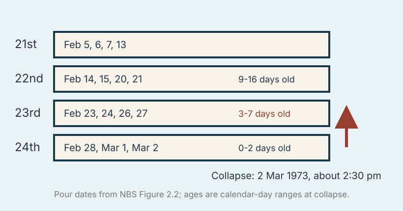
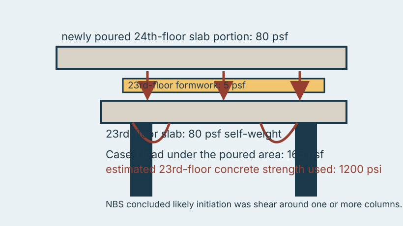
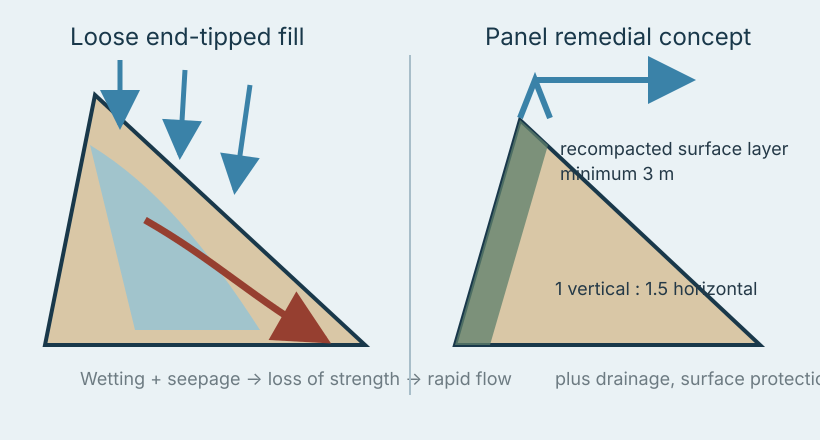
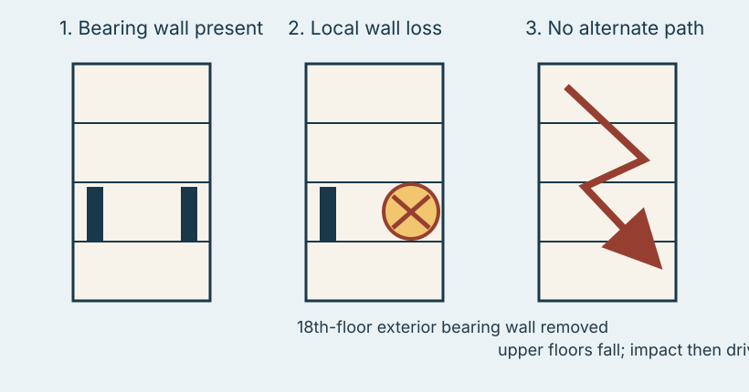
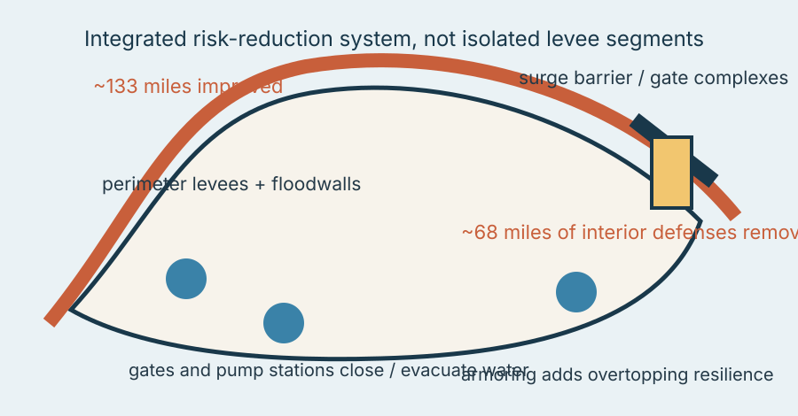
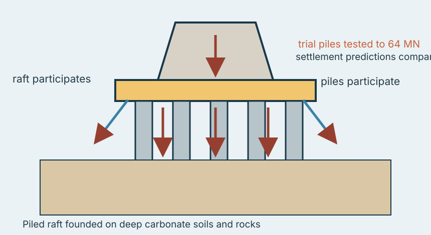

# Engineering Casebook 006 - Capacity Is Conditional

**19 August 2026 - ISSUE-006**

A capacity value never arrives alone. Concrete strength belongs to an age and curing history. Fill strength belongs to density and moisture state. A bearing wall belongs to a load path that may or may not survive its loss. Flood protection belongs to a closed, maintained system. Foundation capacity belongs to interaction between raft, piles, ground and structure. This issue is about the conditions hidden behind the number.

---

## PAGE 1 - DEEP DIVE

# Skyline Plaza
## The slab did not have tomorrow's strength today

**Bailey's Crossroads, Virginia - 2 March 1973 - flat-plate construction - CASE-023**

At about 2:30 p.m. on 2 March 1973, part of Skyline Plaza building A-4 collapsed through the full height of the partially constructed tower and into the adjoining parking garage. Fourteen construction workers were killed and 34 were injured. The National Bureau of Standards investigation concluded that premature removal of supporting forms was a contributing factor. Its structural analysis identified the most likely initiating mode as shear failure around one or more columns in the 23rd-floor slab. [@SRC-0029]

The uncomfortable part is that the permanent drawing was not obviously asking the impossible of a 3000 psi flat plate. The construction state was asking something different of concrete that had not yet reached that strength.

### The building had several clocks running at once

A typical floor was poured in four sections. NBS reconstructed the casting dates near the top of the building: the 23rd-floor sections had been poured on 23, 24, 26 and 27 February, while portions of the 24th floor were poured on 28 February, 1 March and the morning of 2 March. At collapse, different parts of the 23rd floor were only about three to seven calendar days old. [@SRC-0029]

NBS estimated average in-situ concrete strength for the 23rd-floor slab at about **1200 psi** for a well-cured four-day condition in its analysis, compared with the **3000 psi** specified 28-day design strength. That distinction is not trivia. Construction scheduling had converted time into a structural variable.

### YOU ARE THE ENGINEER

A contractor asks to strip shores because the programme says the next floor must start. The concrete mix is specified at 30 MPa at 28 days. What evidence lets you say yes?

Not the 28-day mix designation. You need evidence tied to the actual structural state: field-cured or maturity-correlated strength appropriate to the slab; the loads already on that slab; the loads about to arrive; the shoring/reshoring arrangement; and the shear, flexural and deflection demand that results. If removing support is part of the load case, support removal is an engineering action.

### NBS Case 1 makes the hidden load visible

One NBS analysis assumed the 23rd-floor slab was unshored. Under the portion of the 24th floor that had just been cast, the 23rd-floor system carried about **80 psf** from the new 24th-floor slab, **5 psf** from formwork and **80 psf** from its own slab weight: **165 psf** before future occupancy ever entered the conversation. NBS used the estimated 1200 psi 23rd-floor strength in that case. [@SRC-0029]

The report found the 23rd-floor slab far more critical in shear than in flexure. Its likely initiation was shear around columns in the affected area. Once one column support was lost, the remaining supports could be overstressed. Debris from the top slabs then overloaded lower slabs and drove progressive collapse downward.

This is a construction-stage version of a familiar design error: using the right capacity for the wrong state. A beam may eventually have composite action; a slab may eventually have full concrete strength; a retaining wall may eventually have its permanent drainage and backfill; a frame may eventually have all bracing installed. None of those future facts are present tense.

### The shoring map is part of the structural model

NBS could not establish every shore and reshore position with certainty. Employee statements conflicted, and additional shoring was installed after the collapse before investigators gained full access. That uncertainty itself is instructive. If safety depends strongly on a temporary support arrangement, that arrangement should be documented well enough that the engineer can state what structure exists at each stage.

### Engineer's Notebook - NOTE-006

**Capacity is conditional on state, continuity and interaction.** A nominal material or member capacity is not a free-standing property. Ask which age, moisture state, support arrangement, load path or system interaction makes that capacity available in the condition being checked.

### Evidence boundary

The figures use casting dates and the NBS Case 1 loads/strength directly from the investigation. They do not claim a complete as-built shoring layout, because the report itself documents uncertainty about that layout.

### Sources for this case

**Primary - Tier A:** National Bureau of Standards / NIST, *Investigation of the Skyline Plaza Collapse in Fairfax County, Virginia (NBS BSS 94)*, 1977.  
https://www.nist.gov/publications/investigation-skyline-plaza-collapse-fairfax-county-virginia-nbs-bss-94

---

## PAGE 2 - PROBLEMS FROM PRACTICE

# Site Problem - Sau Mau Ping
## Fill is a construction product, not just a soil name

**Hong Kong - 1976 disaster / GEO review - CASE-024**

The 1976 Sau Mau Ping fill-slope failure killed 18 people after wet mud entered the lower floors of Block 9. The independent review panel concluded that water penetrated the slope face, created a wetted zone and reduced the strength of loose fill until downhill movement developed and rapidly converted into a mud avalanche. Investigations showed the slope face had been formed by **end-tipping fill in a loose condition**. [@SRC-0030]

That makes this an earthworks-quality problem as much as a rainfall problem. Two slopes can be drawn with identical geometry and described with the same broad soil type while having very different performance because one has been placed and compacted as engineered fill and the other has been tipped loose down a face.

### YOU ARE THE ENGINEER

You inherit an old fill slope behind a building. The drawings say “compacted fill,” but there are no placement records. Do you accept the label?

Treat it as a hypothesis. Look for density evidence, layering, signs of end-tipping, services that can leak, seepage paths and the condition of surface drainage. If consequence warrants it, investigate the fill profile rather than assuming the historical specification describes the historical workmanship.

The panel's generic stabilisation concept was deliberately physical: recompact a surface layer at least **3 m** thick, form it to about **1V:1.5H**, and provide drainage, surface protection and safeguards against leaking services. Those numbers belong to that review, not to every slope; the transferable lesson is that compaction, geometry and water control work together. [@SRC-0030]

### Engineer's Notebook

**Ask how the fill got there.** Placement history is a material property in disguise.

### Evidence boundary

The panel's remedial dimensions are historical recommendations for suspect Hong Kong fill slopes, not substitute inputs for a site-specific stability design.

### Sources for this case

**Primary - Tier A:** Hong Kong Geotechnical Engineering Office, *Report of the Independent Review Panel on Fill Slopes*, GEO Report No. 86.  
https://www.cedd.gov.hk/eng/publications/geo/geo-reports/geo_rpt086/index.html

# Detail / Robustness - Ronan Point
## The wall carried load; the system could not lose the wall

**London - 16 May 1968 - large-panel precast construction - CASE-025**

A domestic gas explosion on the 18th floor of Ronan Point blew out load-bearing wall panels. The official inquiry found that the explosion caused the local wall loss and that the ensuing partial collapse was inherent in the building's design. NIST's later case history describes a precast wall-and-floor system whose floors were supported directly by wall panels and whose connections offered no redundant load path after a local bearing wall disappeared. [@SRC-0031] [@SRC-0032]

The upper floors first lost support and fell. Their impact then exceeded the capacity of lower floors and drove collapse downward. NIST's central diagnosis is **lack of structural integrity**: there was no alternate load path for the forces at the onset of bearing-wall loss. [@SRC-0032]

This is why connection design cannot stop at “can the panel carry its normal reaction?” Robustness asks a different question: can floors tie together, span differently, develop catenary action or otherwise bridge a local loss long enough to prevent disproportionate collapse?

NIST also records poor workmanship in some connections, including incomplete mortar and improperly tightened bolts, but notes that those defects had little impact on the initiating event. That matters. A memorable defect should not be allowed to steal the causal role from the system-level weakness actually identified by the investigation.

### Detail checklist

For vertical support details, check **bearing + tying + alternate path + debris consequence**. The first item proves the normal state; the next three address the damaged state.

### Sources for this case

**Primary - Tier A:** UK National Archives, inquiry material on the Ronan Point collapse, 1968.  
https://www.nationalarchives.gov.uk/education/resources/sixties-britain/ronan-point-collapse/  
**Supporting - Tier A:** NISTIR 7396, *Best Practices for Reducing the Potential for Progressive Collapse in Buildings*, 2007.

---

## PAGE 3 - ENGINEERING DONE WELL

# Civil Engineering Win - Greater New Orleans HSDRRS
## The line of defense became a system

**Louisiana - post-Katrina reconstruction - CASE-026**

The Hurricane and Storm Damage Risk Reduction System around greater New Orleans is useful precisely because its achievement cannot be reduced to one stronger levee. FEMA accredited the system in 2014 after determining that the improvements reduce risk from effects associated with the 1-percent annual chance storm. USACE reported that nearly **133 miles** of levees, floodwalls, gated structures and pump stations had been strengthened or improved. New surge barriers and closure complexes moved the primary line of defense outward, removing about **68 miles** of interior levees and floodwalls from direct storm-surge exposure. [@SRC-0033]

### Closing the hydraulic boundary

A flood-defense system has an awkward property: the weakest open path can govern the result. A taller levee does little if an adjacent gate cannot close. A closed perimeter creates a new problem if rainfall and pumped drainage cannot get out. A structurally strong crest can still lose the embankment if overtopping erodes the protected-side slope. HSDRRS addresses those conditions with a portfolio rather than a single section type: perimeter levees and floodwalls, surge barriers, gates, pump stations and armoring.

The most interesting design move was to change **where** surge is resisted. USACE describes surge barriers at Lake Borgne, Seabrook, the outfall canals and the West Closure Complex as pushing the line of defense outside the city. That reduces the length of interior defenses directly exposed to surge, which changes the topology of the risk problem rather than merely thickening every existing component. [@SRC-0033]

### A system can be accredited and still need future work

The word “win” deserves a footnote. FEMA accreditation is not a certificate of flood-proof immortality. USACE explicitly continues work on armoring, pumping and future levee lifts because consolidation, settlement, subsidence and sea-level conditions change the available elevation over time. Capacity is conditional here too: a crest elevation is a depreciating asset unless the system is monitored and maintained.

That is a useful habit for ordinary civil works. When reviewing a drainage network, retaining-wall system, road embankment or flood wall, draw the full boundary and mark every closure, low point, outlet, transition and maintenance-dependent component. Strong components do not average out an open path.

### System review - four questions

**Where is the boundary?** Define the entire line that must resist water.  
**How does it close?** Identify gates, penetrations, transitions and temporary openings.  
**What happens inside?** Account for rainfall, seepage and pumped drainage after closure.  
**How does capacity change with time?** Settlement, erosion, corrosion, vegetation and mechanical reliability all alter the future state.

### Engineer's Notebook

**Review continuity before average strength.** A protection system succeeds when every required element is available in the same event.

### Evidence boundary

The 1-percent annual chance accreditation is a risk-reduction standard, not a guarantee against all storms. The case uses the 2014 accreditation and system configuration as the measured outcome; it does not claim zero residual flood risk.

### Sources for this case

**Primary - Tier A:** U.S. Army Corps of Engineers / FEMA, *FEMA Accredits Hurricane and Storm Damage Risk Reduction System (HSDRRS)*, 21 February 2014.  
https://www.mvd.usace.army.mil/Media/News-Releases/Article/473867/fema-accredits-hurricane-and-storm-damage-risk-reduction-system-hsdrrs/

---

## PAGE 4 - ENGINEERING DONE WELL / SYNTHESIS

# Geotechnical Engineering Win - Burj Khalifa
## Test the foundation system you actually designed

**Dubai - piled raft - CASE-027**

The Burj Khalifa foundation was designed as a **piled raft** on deep carbonate soils and rocks. The design programme combined ground investigation, numerical analysis, peer review and full-scale pile testing. The 2008 project paper reports trial piles loaded to as much as **64 MN**, with predicted load-settlement behaviour compared against measured response and tower settlements monitored during construction. [@SRC-0034]

A piled raft is a useful antidote to component thinking. The piles do not act in splendid isolation while the raft politely watches. Raft contact, pile stiffness, pile-soil interaction, ground stiffness and the superstructure all influence the settlement field. The later peer-reviewed re-assessment used two piled-raft analysis methods and found calculated average and differential settlements in reasonable agreement with measured data near the end of construction. It also emphasised that reaction piles used in a load test can influence the interpreted test-pile response. [@SRC-0035]

That last point is wonderfully transferable: even the **test** has a system boundary. A number read from an instrument is not self-interpreting evidence if the test setup changes the response being measured.

### Practical transfer

For an ordinary piled building, ask whether the design is being treated as “pile capacity x number of piles” when settlement, raft contact or group interaction actually governs. Where pile tests are used, document how the setup, reaction system, loading sequence and interpretation map back to the foundation model. Where settlement matters, monitor the structure at stages that can still inform decisions.

### Evidence boundary

The main foundation-design paper is authored by project specialists, and the later peer-reviewed re-assessment includes specialists involved in analysis and peer review. The evidence is strong for documented design/testing/performance, but it is not an independent forensic audit and does not make piled rafts universally preferable.

### Sources for this case

**Primary - Tier B:** Poulos & Bunce, *Foundation Design for the Burj Dubai - the World's Tallest Building*, 2008.  
https://scholarsmine.mst.edu/icchge/6icchge/session_01/14/  
**Supporting - Tier A:** Russo, Abagnara, Poulos & Small, *Re-assessment of foundation settlements for the Burj Khalifa, Dubai*, Acta Geotechnica, 2013.

## The Thread - Capacity Is Conditional

Skyline Plaza says concrete strength belongs to a date and support arrangement. Sau Mau Ping says fill strength belongs to placement and wetting history. Ronan Point says local bearing capacity is not the same as system robustness. HSDRRS says flood-defense capacity belongs to a closed and maintained perimeter. Burj Khalifa says foundation performance belongs to interaction between raft, piles, ground, test setup and structure.

The recurring engineering move is to replace **“what is the capacity?”** with **“what conditions make that capacity available?”** The second question exposes time, water, continuity, construction sequence and interaction - exactly the things a tidy calculation is most tempted to hide.

## 60-Second Takeaway

- Never borrow 28-day concrete strength for a younger construction stage without evidence.
- Treat placement and compaction history as part of the material definition for fill.
- For critical supports, check the damaged state and alternate load path, not only normal bearing.
- Review flood and drainage defenses as continuous systems with closures, outlets and maintenance-dependent elements.
- Use full-scale tests and monitoring to calibrate the foundation system, not merely to decorate the calculation report with data.

## Archive Recall

Which earlier Casebook case showed that a temporary support system becomes the primary gravity system while the permanent load path is unavailable, and what local hardware mechanism initiated that failure?
