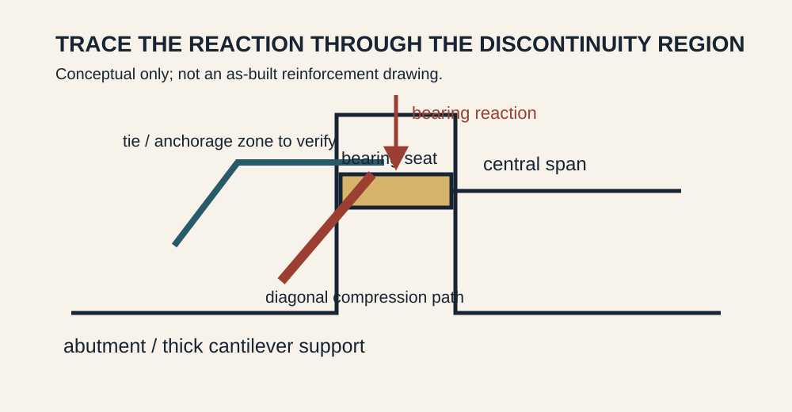
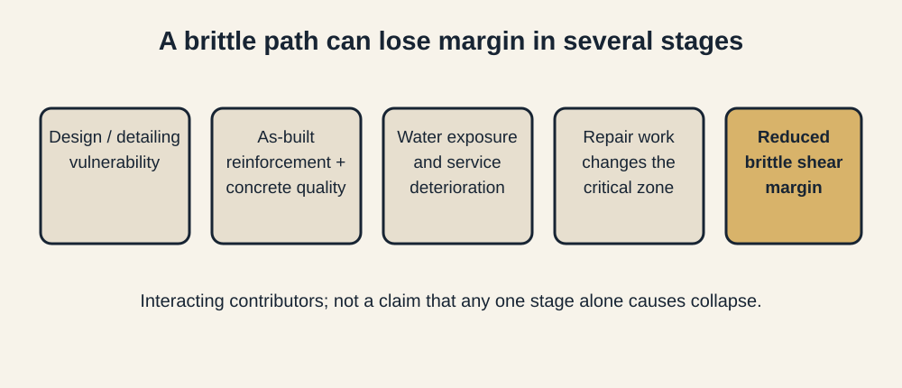
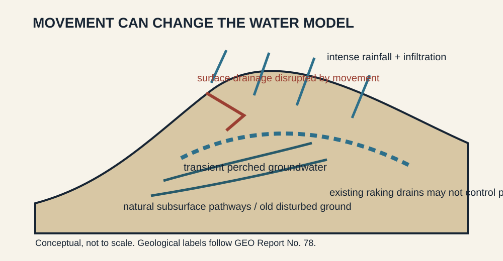
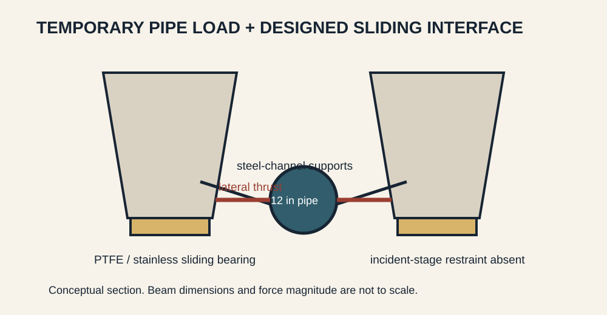
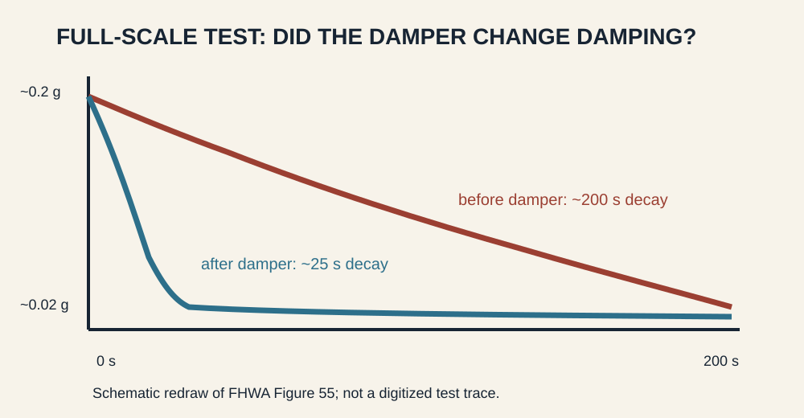
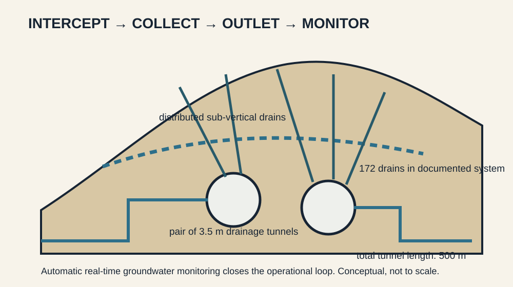

# Engineering Casebook 007 - Give It a Path

**19 August 2026 - ISSUE-007**

Loads move. Water moves. Structures move. Trouble begins when the engineer has described the component but not the path. A bearing reaction still needs a credible route through concrete and reinforcement. Rainfall still needs a route off a moving slope. A temporary pipe still pushes somewhere. Cable vibration still needs somewhere for its energy to go. Groundwater still needs a maintainable path to an outlet. This issue follows those paths.

---

## PAGE 1 - DEEP DIVE

# de la Concorde Overpass
## A massive support can still have a brittle internal path

**Laval, Quebec - 30 September 2006 - reinforced-concrete bridge support - CASE-028**

A portion of the de la Concorde overpass collapsed onto Autoroute 19 after about 36 years in service. Five people were killed and six were injured. Quebec established a public commission to determine the causes and recommend how similar failures should be prevented. The later peer-reviewed structural reconstruction describes the failed element as a thick reinforced-concrete cantilever slab supporting the central precast span and explains the collapse as failure of that slab under essentially its own weight after long-term deterioration. [@SRC-0036] [@SRC-0037]

The unnerving lesson is not that the support was slender. It was the opposite. The region looked substantial. But visual mass is not a load path.

### Start at the bearing and keep tracing

At the end of the central span, bearing reaction entered a seat at the end of the cantilever. From there, force had to turn and spread through a discontinuity region before reaching the body of the abutment. That is precisely where ordinary beam intuition becomes unreliable: shear, diagonal compression, local tension and anchorage all interact.

The inquiry and later technical literature identify a combination rather than a single theatrical defect. Improper reinforcement detailing during design, improper reinforcement placement during construction and low-quality concrete were identified among the principal physical causes. Contributing factors included the absence of shear reinforcement in the thick slab, inadequate protection against water and weakening associated with repair work. [@SRC-0036] [@SRC-0037]

This distinction matters. Deterioration did not visit an otherwise perfect load path and suddenly invent a new failure mode. It acted on a detail whose ability to carry shear and anchor internal forces was already unforgiving.

### Why shear details deserve more suspicion than their size suggests

Flexural distress often gives engineers a useful luxury: deformation. Brittle shear regions can be much less conversational.

The peer-reviewed reconstruction discusses the as-designed and as-built reinforcement, physical testing of a simulated portion of the bridge, structural analysis under different bridge-code provisions and nonlinear analysis incorporating deterioration. Its conclusion is striking in its simplicity: the thick cantilever slab could fail under essentially self-weight after decades in service. [@SRC-0037]

The transfer to ordinary practice is immediate. A thick slab under a column, a corbel carrying a precast beam, a half-joint, a transfer nib or a bearing shelf may contain a very short and very important force route. If the geometry changes abruptly, draw the strut-and-tie logic even when the member looks embarrassingly large.

### YOU ARE THE ENGINEER

You are asked to assess an old concrete bearing seat. The member is thick and the calculated average shear stress does not look alarming. Water staining is visible below the joint. What do you check before accepting the average number?

First, reconstruct the actual discontinuity-region load path: where the reaction enters, where diagonal compression can develop, what reinforcement provides the tie, and whether that reinforcement is anchored on the correct side of the potential cracking zone. Then verify the as-built reinforcement rather than assuming the drawing was achieved. Add durability: joint leakage, chloride exposure, cracking, previous concrete removal and repair history. Finally, ask whether the critical zone is actually inspectable.

A global average stress can be mathematically correct while describing the wrong mechanism.

### Repair is another structural stage

Repairs are often discussed as if the structure merely pauses while damaged concrete is exchanged for fresh concrete. In reality, removal changes section geometry, restraint and load transfer while the work is underway. The de la Concorde inquiry identified damage associated with earlier repair work as a contributing physical factor. That makes the repair sequence part of the engineering model, not an administrative appendix.

For critical support regions, the repair package should answer the same questions as a temporary-works design: what carries the load while concrete is removed, what reinforcement must remain protected and anchored, how much material can be removed at once, and how the restored section reconnects to the old force path.

### Inspection access is also part of the path

A load path can be analytically beautiful and operationally hostile. Bearing seats, joints and discontinuity regions are exactly where water, debris and movement accumulate, yet they can be difficult to inspect. If deterioration at the critical zone cannot be seen or measured, the maintenance system has inherited a hidden variable.

### Engineer's Notebook - NOTE-007

**Give load, water and motion a deliberate path.** A force, flow or movement does not disappear because the drawing omits it. Identify where it enters, how it crosses every interface, and where it is finally resisted, drained or dissipated.

### Evidence boundary

The figures are mechanism schematics derived from the inquiry record and peer-reviewed structural account. They do not reproduce an as-built bar arrangement, bar sizes, cover, crack dimensions or deterioration quantities that were not directly extracted in this run.

### Sources for this case

**Primary - Tier A:** Commission d'enquête sur le viaduc de la Concorde, *Commission of Inquiry into the Collapse of a Portion of the de la Concorde Overpass, October 3, 2006-October 15, 2007 - Report*, 2007.  
https://www.bibliotheque.assnat.qc.ca/guides/fr/commissions-d-enquete-au-quebec-depuis-1867/7724-commission-johnson-2007

**Supporting - Tier A:** Mitchell, Marchand, Croteau & Cook, *Concorde Overpass Collapse: Structural Aspects*, Journal of Performance of Constructed Facilities, 2011.  
https://doi.org/10.1061/(ASCE)CF.1943-5509.0000183

---

## PAGE 2 - PROBLEMS FROM PRACTICE

# Site Problem - Ching Cheung Road
## Once the slope moves, the drainage drawing may be obsolete

**Hong Kong - progressive failure, July-August 1997 - CASE-029**

The Ching Cheung Road landslide on 3 August 1997 blocked a 50 m section of road and trapped a car; the driver was uninjured. GEO's investigation found that this was not a single instantaneous event. It was the final stage of a progressive process that began with failure on 7 July. [@SRC-0038]

The site already had a long history of instability after earlier quarrying. The decisive 1997 condition was water. Following extremely severe rainfall, a high transient perched water table probably developed, especially below a natural drainage line near the head of the failed slope. The investigation identified natural subsurface pipes, partly associated with decomposed basalt dykes in granite and possibly exploiting older disturbed zones. Existing raking drains installed after an earlier failure could not prevent critical groundwater pressures. [@SRC-0038]

Then the slope made the problem worse for itself. Early movement disrupted surface drainage channels and deformed the ground. Later intense rain therefore had new routes for infiltration, contributing to subsequent collapses. The assumed drainage system and the actual drainage system had diverged.

### YOU ARE THE ENGINEER

A slope behind a building has moved a few centimetres after heavy rain. There is no catastrophic failure, and the old stability calculation included functioning surface drains and horizontal drains. Can you simply rerun the same model with a slightly lower soil strength?

Not yet. First inspect the hydraulic boundary conditions you are about to reuse. Are channels cracked, tilted or disconnected? Has a tension crack become an infiltration trench? Are drain outlets flowing, blocked or damaged? Could movement have opened a preferential groundwater path? The act of moving may have changed the water model.

That is the transferable lesson from Ching Cheung Road: **deformation can invalidate the drainage assumptions that were supposed to limit deformation.**

### Engineer's Notebook

After meaningful slope movement, inspect drains as structural components. A drain shown on an old plan is not evidence that water can still reach it, enter it and leave through it.

### Evidence boundary

The geological pathways described here are specific to the Ching Cheung Road investigation. They are not a generic explanation for every cut-slope failure.

### Sources for this case

**Primary - Tier A:** Hong Kong Geotechnical Engineering Office, *Report on the Ching Cheung Road Landslide of 3 August 1997*, GEO Report No. 78, 1998.  
https://www.cedd.gov.hk/eng/publications/geo/geo-reports/geo_rpt078/index.html

# Detail / Temporary Works - Fort Lauderdale-Hollywood Airport
## The bearing was designed to slide. Nobody gave the temporary load somewhere else to go.

**Florida - 2 November 2013 - precast runway bridge erection - CASE-030**

Five precast beams fell from their bearings during the Fort Lauderdale-Hollywood International Airport runway expansion; another five shifted or overturned but remained on the bents. The beams were about 112 ft long and 6 ft deep, spaced at 8 ft centres. Their diaphragms had not yet been cast. [@SRC-0039]

The detail that turned an ordinary temporary service into a structural event was a 12 in ductile-iron water main roughly 100 ft long. It was supported on steel channels spanning between the sloping bottom flanges of adjacent precast beams.

Those beams sat on PTFE/stainless-steel sliding bearings. The specified friction coefficient was no more than four percent; manufacturer testing reported an average near 1.1 percent, with a selected mean near 0.93 percent. OSHA calculated that very little lateral force was therefore needed to initiate sliding. [@SRC-0039]

The pipe support supplied that force. Because its channels bore against sloping lower flanges, pipe dead load generated horizontal thrust. The specialty designer of the pipe support had not been given drawings showing the sliding-bearing condition. Bearing restraints were absent. The vertical diaphragms that would later tie the system together were not yet in place.

OSHA's conclusion was direct: lateral loads from the pipe initiated the collapse, the beams were not properly braced, and the bearings were not restrained. A specialty engineer had already recommended that the sliding bearings be restrained or continuously monitored. [@SRC-0039]

### Detail checklist

For anything temporarily attached to an incomplete structure, ask four questions:

**What force does its geometry create?** Dead load on a slope creates a horizontal component.  
**What interface receives it?** A sliding bearing is not lateral fixity merely because it is under a very heavy beam.  
**What permanent stabilising elements are still absent?** Diaphragms and deck action belong to the future until they exist.  
**Who has the interface information?** A specialist cannot design around a bearing condition they were never shown.

### Engineer's Notebook

Temporary works fail at organisational interfaces as readily as physical ones. The force path and the information path both have to close.

### Evidence boundary

The causal language and numerical bearing information above are taken from OSHA's forensic report. This case does not reconstruct calculations that the pipe-support designer did not document in that report.

### Sources for this case

**Primary - Tier A:** U.S. Department of Labor, OSHA, *Investigation of the November 2, 2013 Collapse of Concrete Beams at Fort Lauderdale-Hollywood Airport Runway Project*, April 2014.  
https://www.osha.gov/sites/default/files/2019-12/2014_r_02.pdf

---

## PAGE 3 - ENGINEERING DONE WELL

# Structural Engineering Win - Penobscot Narrows Bridge
## Measure the thing the damper claims to change

**Maine - cable-stayed bridge commissioning - CASE-031**

Stay cables are efficient, lightly damped structural elements. That combination makes them susceptible to vibration under wind and rain-wind conditions. On the Penobscot Narrows Bridge, MaineDOT and FHWA used construction as a rare opportunity to measure long stay cables before and after installation of external viscous dampers. [@SRC-0040]

Phase 1 testing took place in December 2006 before the dampers. Phase 2 followed in September 2007 after installation. Accelerometers measured free-decay response after the stays were deliberately excited.

The useful result is not merely that the cables 'felt better.' Before dampers, measured first-mode damping ratios across tested cables were about **0.10-0.39%**. After dampers they were about **1.22-2.21%**. FHWA reported increases by at least a factor of five and sometimes as high as fifteen. The frequencies remained similar, which is exactly what a damping intervention should look like: much more energy dissipation without pretending the cable has become a different spring. [@SRC-0040]

One FHWA comparison makes the change wonderfully visible. For cable 19A, acceleration decayed from about 0.2 g to 0.02 g over roughly 200 seconds before the damper and roughly 25 seconds afterward.

This is commissioning used properly. The test variable matches the design claim. If a damper is meant to add damping, measure damping. If a drain is meant to lower groundwater, monitor groundwater. If a restraint is meant to prevent translation, measure movement before the hidden work disappears.

### Evidence boundary

The damping ratios belong to the tested Penobscot stays and test conditions. They are performance evidence for this system, not target values for every cable-stayed bridge.

### Sources for this case

**Primary - Tier A:** Federal Highway Administration, *Dynamic Properties of Stay Cables on the Penobscot Narrows Bridge*, FHWA-HRT-14-067, September 2014.  
https://www.fhwa.dot.gov/publications/research/infrastructure/structures/bridge/14067/index.cfm

---

## PAGE 4 - ENGINEERING DONE WELL / SYNTHESIS

# Geotechnical Engineering Win - Po Shan Drainage Tunnel
## Give groundwater an accessible route, then check that it still works

**Hong Kong - groundwater regulation for a landslide-prone hillside - CASE-032**

Po Shan carries a grim historical reason to take groundwater seriously. A catastrophic landslide there in 1972 killed 67 people, and subsequent investigation identified high groundwater as an important hillside condition. In the 1980s, GEO installed horizontal drains to lower the water table. [@SRC-0041]

That intervention worked as a concept, but drains age as systems. Monitoring in the early 2000s showed declining discharge from some horizontal drains and locally high groundwater during heavy rainfall. GEO did not treat the old drainage plan as a permanent fact. It built a larger groundwater-regulation system around access, distributed drainage and measurement.

The Po Shan Drainage Tunnel comprises **two 3.5 m diameter drainage tunnels with a total length of 500 m**, connected to **172 sub-vertical drains**. Automatic real-time groundwater monitoring allows GEO to track the condition the system is intended to control. [@SRC-0041]

The cleverness is not the tunnel diameter by itself. It is maintainability. Long underground access turns many deep drains from inaccessible buried interventions into components of an inspectable system. Water receives a deliberate route from hillside to drain to tunnel to outlet, while instrumentation reports whether groundwater is responding.

That is transferable far below tunnel scale. A retaining wall needs weepholes or drains that can actually discharge. A basement relief system needs maintainable pumps or gravity outlets. A slope drain needs an outlet that can be found after vegetation grows. The useful design question is not 'did we install drainage?' but **'can we tell when the drainage stops doing its job?'**

### Evidence boundary

The available source is government project documentation describing the system and its risk-reduction purpose. It is not an independent peer-reviewed audit of long-term performance, so this case does not claim a measured universal reduction in landslide probability.

### Sources for this case

**Primary - Tier A:** Hong Kong CEDD / Geotechnical Engineering Office, *Po Shan Drainage Tunnel - Landslide Sci-Tech Chamber*.  
https://hkss.cedd.gov.hk/hkss/en/visit-tour/po-shan-drainage-tunnel/index.html

## The Thread - Give It a Path

de la Concorde says a bearing reaction needs an internal route through a discontinuity region that remains credible after construction, deterioration and repair. Ching Cheung Road says rainfall and groundwater will exploit routes that movement itself can create. Fort Lauderdale says a temporary lateral force will find the freedom deliberately built into a sliding bearing if restraint is absent. Penobscot says unwanted motion can be given a measured dissipation path. Po Shan says groundwater control works best as an accessible, monitored route rather than a buried promise.

The recurring move is simple: draw arrows until they end somewhere real.

For force, the arrow should end at a stable reaction. For water, at a reliable outlet. For motion, at an intentional restraint or dissipater. Then ask whether every intermediate interface exists **in the state being checked**, not merely in the finished drawing.

## 60-Second Takeaway

- At corbels, bearing seats, half-joints and thick slabs, trace the discontinuity-region force path instead of trusting visual mass.
- After slope movement, re-inspect drainage and groundwater assumptions; deformation can change the hydraulic model.
- Temporary services can create lateral loads. Check the actual bearing and restraint state before permanent diaphragms or ties exist.
- Commission an intervention by measuring the parameter it is supposed to improve.
- Treat drainage as a maintainable, observable system with a complete route to an outlet.

## Archive Recall

Which earlier Casebook case used targeted groundwater-pressure relief as an active intervention during underground construction, and what did monitoring contribute to the decision?
