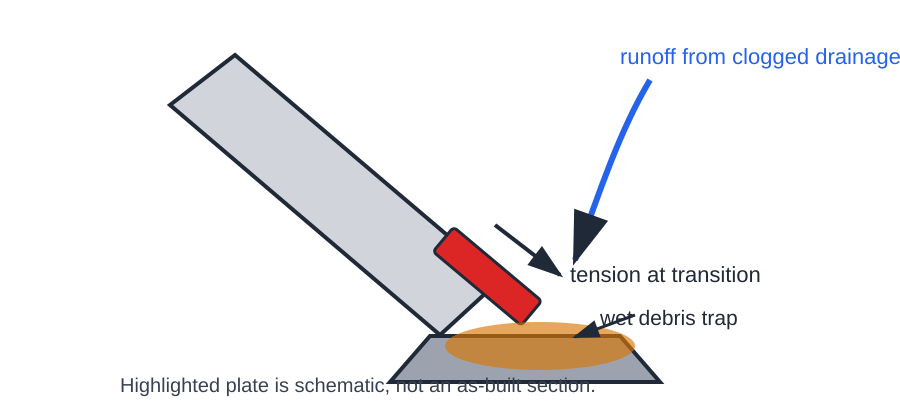
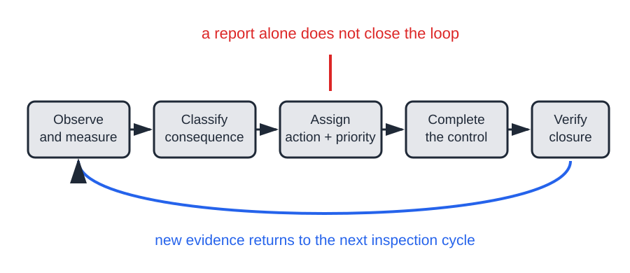
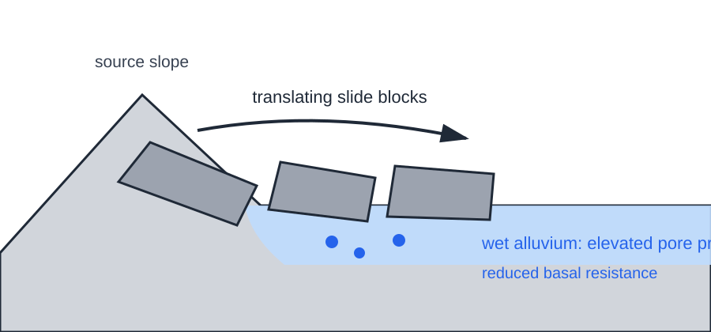
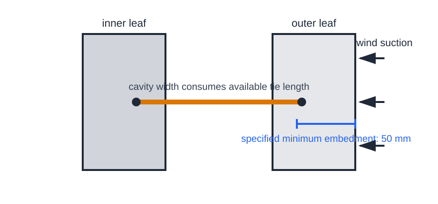
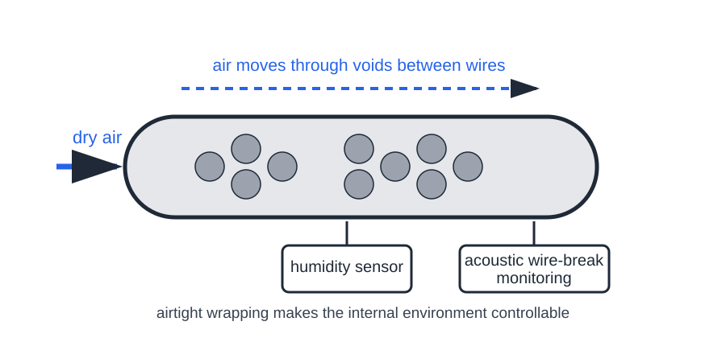
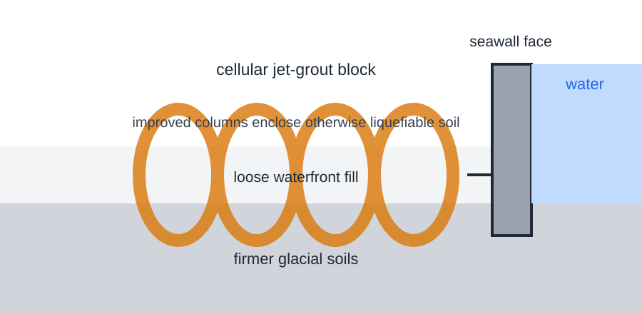

# Engineering Casebook 008 - The Hidden Layer

**3 September 2026 - ISSUE-008**

The visible structure is only the outermost layer of the engineering problem. A bridge can look serviceable while a small nonredundant plate loses most of its section. A slope can fail in one place and travel much farther because the ground beneath the moving mass liquefies. A cavity wall can conceal ties that never achieved the embedment shown on the drawing. A suspension cable can hide thousands of wires behind wrapping. A waterfront can sit over fill that changes character under earthquake loading.

This issue is about making hidden conditions explicit enough to inspect, test, monitor or improve.

---

## PAGE 1 - DEEP DIVE

# Fern Hollow Bridge
## The inspection report can contain the warning and still fail to control the risk

**Pittsburgh, Pennsylvania - 28 January 2022 - weathering-steel rigid-frame bridge - CASE-033**

At about 6:37 a.m. on 28 January 2022, the Fern Hollow Bridge carrying Forbes Avenue over Frick Park suffered a structural failure and fell roughly 100 ft into the park. The bridge was 447 ft long. The National Transportation Safety Board determined that collapse initiated at the southwest bridge leg when a transverse tie plate failed after extensive corrosion and section loss. [@SRC-0042]

That sounds like an ordinary corrosion story until the geometry is traced. The tie plate sat where the inclined bridge leg tapered into the shoe at the thrust block. It looked similar to transverse stiffeners higher on the leg, but it was wider and thicker because it had a different job. The changing leg geometry produced tension in the plate, and the plate was nonredundant. Its failure could therefore remove a critical part of the load path. NTSB concluded that it should have been identified as a fracture-critical member, now termed a nonredundant steel tension member. [@SRC-0042]

### FACT - water and debris changed the material environment

The bridge used uncoated weathering steel. That material depends on repeated wetting and drying to develop a stable protective patina. At Fern Hollow, clogged drains allowed water to run down the legs, while leaves and dirt accumulated near their bases. The wet debris kept the steel from drying as intended. The detail therefore lived in a different exposure condition from the one suggested by the generic material description. [@SRC-0042] [@SRC-0043]

Inspection reports had been documenting the deterioration for years. NTSB records holes and section loss in the legs from at least 2005 onward. A 2013 inspection documented an 11 in by 11 in area of 100% web section loss above the southwest tie plate; by 2021 the reported hole was 12 in by 12 in. Clogged drains and debris accumulation were also repeatedly recorded. [@SRC-0042]

The decisive measurement came after the collapse. NTSB's corrosion mapping found that only about 12.5% of the original thickness remained in much of the southwest transverse tie plate, corresponding to an 87.5% reduction in cross-sectional area. Finite-element modelling using the original, uncorroded geometry showed adequate strength for the loads present at collapse; modelling with the documented section loss did not. [@SRC-0042]

### FINDING - the failure was not simply that nobody looked

NTSB's probable cause was failure of the transverse tie plate due to corrosion and section loss resulting from the City of Pittsburgh's failure to act on repeated maintenance and repair recommendations. Contributing factors included poor inspection quality, incomplete identification of fracture-critical members, incorrect load-rating calculations and insufficient PennDOT oversight. [@SRC-0042]

This distinction is important. An inspection system can generate observations without generating safety. The control loop is not complete until a finding is correctly classified, its structural consequence is understood, an action is assigned at an appropriate priority, and the action is verified as complete.

The federal response makes the same point in a broader form. In July 2023, while the NTSB investigation was still underway, FHWA directed agencies to identify vulnerable uncoated-weathering-steel bridges and follow up on inspection findings, specifically noting Fern Hollow's drainage details, debris traps and incomplete maintenance actions. [@SRC-0043]

### YOU ARE THE ENGINEER

You inspect a steel support and find severe local corrosion next to a drain outlet. The rest of the member is visually substantial. What changes the response from "record deterioration" to "treat as a structural risk"?

First identify the actual force carried by the corroded piece. Is it merely a stiffener, or does geometry put it in tension? Is there another load path if it fractures? Then expose and clean enough material to measure remaining section rather than estimating through scale and pack rust. Check why the area remains wet, because repairing steel while leaving the water path intact merely resets the clock. Finally, connect the finding to a dated closure: repair, restriction, analysis, monitoring or another explicit disposition.

The useful question is not whether the defect appears local. It is whether the consequence of that local defect is local.

### Engineer's Notebook - NOTE-008

**Verify the hidden layer.** A condition that cannot be seen in normal service needs another route into the engineering model: intrusive inspection, test data, instrumentation, staged hold points or deliberately conservative assumptions.

### Evidence boundary

The dimensions and percentages above are those reported by NTSB. The figures are editorial mechanism diagrams and do not reproduce the bridge's complete as-built geometry or corrosion map. No undocumented traffic load, residual capacity or corrosion rate is inferred.

### Sources for this case

**Primary - Tier A:** National Transportation Safety Board, *Collapse of the Fern Hollow Bridge, Pittsburgh, Pennsylvania, January 28, 2022*, Highway Investigation Report HIR-24-02, 21 February 2024.  
https://www.ntsb.gov/investigations/AccidentReports/Reports/HIR2402.pdf

**Supporting - Tier A:** Federal Highway Administration, *Inspection Finding Follow-up Actions for Uncoated Weathering Steel Bridges*, 19 July 2023.  
https://www.fhwa.dot.gov/bridge/inspection/Memo_July2023_UWS.cfm

---

## PAGE 2 - PROBLEMS FROM PRACTICE

# Site Problem - Oso Landslide
## Runout can be governed by the ground beneath the moving mass

**Snohomish County, Washington - 22 March 2014 - rapid landslide and long runout - CASE-034**

The Oso, or SR-530, landslide was devastating not only because a large slope failed, but because the failed mass travelled across more than a kilometre of river valley. Forty-three people were killed. USGS geotechnical work describes an estimated landslide volume of about 8.3 million m3, an average speed near 64 km/h and a crossing of roughly 1100 m of floodplain in about 60 seconds. [@SRC-0045]

A later peer-reviewed USGS study focused on the exceptional mobility. Field mapping found hundreds of transient sand boils in the runout zone, evidence of elevated pore-water pressures at the base. Collins and Reid concluded that wet alluvium beneath the moving mass liquefied, allowing relatively intact landslide hummocks to translate long distances over the flat valley. Most of the landslide mass itself did not liquefy. [@SRC-0044]

### FINDING - initiation and consequence were different questions

The post-event work distinguishes the conditions that let the slope fail from the mechanism that helped the failed mass travel unusually far. That matters in ordinary hazard work. A stability calculation at the source slope answers an initiation question. It does not automatically bound the consequence zone.

### YOU ARE THE ENGINEER

A proposed building sits beyond the toe of an old landslide but on a flat alluvial terrace. The slope assessment says the building is outside the likely initial failure footprint. Before treating that as the hazard boundary, ask what the moving mass would encounter after failure. Could loose saturated deposits lose strength under rapid undrained loading? Are there geomorphic records of older long-runout events? Is the mapped exclusion zone based on source geometry alone, or on a credible runout model?

### Evidence boundary

USGS examined several possible contributors to basal liquefaction, including rapid undrained loading and ground shaking. The casebook does not claim a universal liquefaction mechanism for landslides, nor does it transfer Oso's measured speed or runout distance to other sites.

### Sources for this case

**Primary - Tier A:** Collins & Reid, USGS / Geological Society of America Bulletin, *Enhanced landslide mobility by basal liquefaction: the 2014 SR530 (Oso), Washington landslide*, 2019.  
https://pubs.usgs.gov/publication/70209110

**Supporting - Tier A:** Riemer et al., U.S. Geological Survey Open-File Report 2015-1089, *Geotechnical soil characterization of intact Quaternary deposits forming the March 22, 2014 SR-530 (Oso) landslide*, 2015.  
https://pubs.usgs.gov/of/2015/1089/

# Detail / Robustness - Oxgangs Primary School
## A hidden tie is only as real as its embedment

**Edinburgh, Scotland - 29 January 2016 - cavity-wall gable failure - CASE-035**

Part of an external wall at Oxgangs Primary School collapsed before normal school opening. The independent inquiry commissioned by the City of Edinburgh Council later examined Oxgangs and defects found across the related PPP1 school estate. [@SRC-0046]

The specified cavity-wall ties were to be bedded at least 50 mm into the mortar joint of each leaf. The inquiry concluded that the primary cause of the Oxgangs collapse was poor-quality construction that failed to achieve the required minimum embedment, particularly in the outer brick leaf. Survey work also identified varying cavity width and wall verticality as contributors to inadequate tie embedment. [@SRC-0046]

The mechanism is small enough to be missed during a busy inspection. Wind suction tries to pull the outer leaf away from the inner leaf. The tie transfers that out-of-plane load through bond and embedment at each end. If the cavity grows wider than intended, or the tie is pushed farther into the first leaf to stop it falling out before the second leaf is built, the remaining embedment in the outer leaf can disappear quietly inside the finished wall.

The inquiry recorded that, across the 17 projects surveyed, exposed ties with embedment below 50 mm ranged from 0% to 92%, averaging 47%. It also concluded that the widespread nature of the defects pointed to inadequate supervision or inadequate action on what should have been observed. [@SRC-0046]

### INTERPRETATION - hidden work needs a hold point

For ordinary building work, this is brutally transferable. A drawing note saying "50 mm min embedment" is not a quality system. The detail becomes verifiable only if cavity width, tie type, tie length, spacing and actual embedment are checked while they remain accessible, with a sampling plan and a response when tolerances drift.

The inquiry identified a Vista VT1 heavy-duty strip tie as the type used at the Oxgangs gable. This issue does **not** attribute the collapse to the product itself; the inquiry's primary finding concerned construction quality and achieved embedment. [@SRC-0046]

### Sources for this case

**Primary - Tier A:** *Report of the Independent Inquiry into the Construction of Edinburgh Schools*, February 2017.  
https://www.labss.org/sites/default/files/Inquiry_into_Edinburgh_Schools___February_2017_FINAL_VERSION.pdf

**Supporting - Tier B:** Alastair Soane, Institution of Structural Engineers, *SCOSS Alert: Inquiry into the construction of Edinburgh schools*, 3 April 2017.  
https://www.istructe.org/journal/volumes/volume-95-(2017)/issue-4/scoss-alert-inquiry-into-the-construction/

---

## PAGE 3 - ENGINEERING DONE WELL

# Structural / Civil Engineering Win - Forth Road Bridge
## Open the cable, change its environment, then keep listening

**Scotland - 2004 onward - suspension-bridge main-cable preservation - CASE-036**

The first internal inspection of the Forth Road Bridge main suspension cables in 2004-05 found broken and heavily corroded wires and an estimated 8-10% loss of cable strength. A 2008 inspection estimated about 10% loss. Transport Scotland's project documentation records that, without reducing deterioration, load restrictions were expected to become necessary. [@SRC-0048]

The response did not rely on a better paint colour on the outside. Engineers addressed the environment inside the cable. The system wrapped the main cables in an airtight membrane and pumped dry air through the voids between wires to reduce moisture and arrest or slow corrosion. Acoustic monitoring was also installed to detect further wire breaks. [@SRC-0048] [@SRC-0049]

Crucially, the intervention remained falsifiable. A Scottish Government information release states that cable inspections in 2006, 2009, 2012 and 2015 found the dehumidification system effective in arresting further cable corrosion, while acoustic monitoring continued to track wire breaks. [@SRC-0049]

That is the win: a hidden deterioration mechanism was first revealed by intrusive inspection, then altered by environmental control, then watched using an independent signal. The inspection method, intervention and monitoring method answer different questions.

### Engineer's Notebook

When a preservation strategy claims to stop a mechanism, measure the mechanism or a defensible proxy. "System operating" is not the same as "asset condition stable."

### Evidence boundary

The cited government material supports the inspection findings and effectiveness statement. This issue does not infer zero future wire breaks, zero maintenance or unlimited service life.

### Sources for this case

**Primary - Tier A:** Transport Scotland, *Forth Replacement Crossing Environmental Statement - Chapter 2: Need for the Scheme*.  
https://www.transport.gov.scot/publication/forth-replacement-crossing-environmental-statement/j11223-007/

**Primary follow-up - Tier A:** Scottish Government, *Forth Road Bridge maintenance: EIR release*, 30 November 2017.  
https://www.gov.scot/publications/foi-17-02563/

---

## PAGE 4 - ENGINEERING DONE WELL / SYNTHESIS

# Geotechnical / Site Engineering Win - Elliott Bay Seawall
## Improve the soil that the visible structure has to trust

**Seattle, Washington - completed 2017 - seismic waterfront renewal - CASE-037**

Seattle's old central waterfront seawall sat in a difficult system: aging structural components, marine exposure, voids from loss of fill, and loose waterfront soils vulnerable to liquefaction. A City of Seattle existing-conditions report found that significant earthquakes could produce liquefaction severe enough to threaten portions of the old seawall. [@SRC-0050]

The replacement did not treat the wall face as the whole problem. The project used jet grouting to mix in-situ soil with grout, forming columns of improved ground. Seattle project documentation describes those columns arranged as a cellular or honeycomb system and extending to firmer glacial soils; the cells enclose otherwise liquefiable soil and form the structural spine behind the new seawall face. [@SRC-0051]

An SDOT construction update described roughly 6,000 jet-grout columns and approximately 3.1 million cubic feet of grout over the project. The completed seawall section between S Washington Street and Virginia Street was finished in 2017 and built to current earthquake-safety standards. [@SRC-0051] [@SRC-0052]

The transferable lesson is not "use jet grout." It is to identify which hidden layer actually governs the design objective. For a basement, quay wall, road approach or retaining structure, a stronger visible element may do little if the supporting ground can liquefy, spread, erode or settle away from it. Ground improvement, drainage, deep foundations or geometry changes are different tools for the same first question: what has to remain competent underneath?

### Evidence boundary

The casebook describes the documented ground-improvement concept and construction quantities. It does not claim performance in an earthquake that has not occurred, nor does it infer design strengths, column diameters or acceptance criteria not extracted from the project sources.

### Sources for this case

**Primary - Tier A:** City of Seattle, *Elliott Bay Seawall Existing Conditions Report*, October 2008.  
https://www.seattle.gov/documents/departments/waterfront/usace_seawall_existing_conditions_report.pdf

**Project documentation - Tier A:** Seattle Department of Transportation, *A Seawall Update: Jet Grouting, It's providing a strong foundation*, 11 February 2015.  
https://sdotblog.seattle.gov/2015/02/11/a-seawall-update-jet-grouting-its-providing-a-strong-foundation/

**Project record - Tier A:** City of Seattle Waterfront, *Seawall*.  
https://seattle.gov/waterfront/projects/seawall

## The Thread - The Hidden Layer

Fern Hollow shows that a small plate can be structurally decisive even when the surrounding steel looks massive. Oso shows that the material beneath a moving slide can control how far the consequence travels. Oxgangs shows that a connection can disappear inside a cavity while the elevation looks finished. Forth shows how intrusive inspection, environmental control and monitoring can turn an invisible cable condition into a managed variable. Elliott Bay shows that the visible wall is only as resilient as the ground system behind and beneath it.

There is a useful design habit hiding in all five cases: **name the condition you cannot see after handover, and decide how you will know whether it is still acceptable.**

## 60-Second Takeaway

Hidden conditions deserve explicit verification routes. For load paths, identify nonredundant details rather than judging by visual mass. For slopes, separate initiation from runout and inspect what the moving mass will travel over. For cavity construction, create hold points before ties and restraints disappear. For durability interventions, monitor the mechanism rather than the mere operation of equipment. For ground improvement, define the soil behaviour that the visible structure needs in order to work.

## Archive Recall

From ISSUE-007: Po Shan's drainage tunnels made a buried groundwater-control system accessible and monitorable. The same principle returns here in a broader form. If a critical condition will be hidden, design a route back to evidence.
